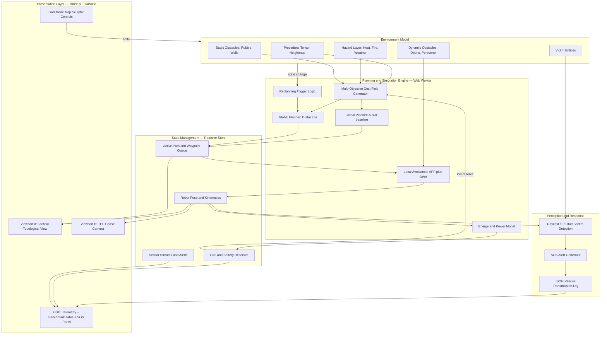

# AEGIS-NAV — Submission Content
**Challenge 1: Autonomous Path Planning with Dynamic Obstacle Avoidance**

---

## 1. Proposed Solution

AEGIS-NAV is a simulated autonomous navigation and command platform for search-and-rescue rovers operating in disaster-affected, dynamically changing environments. Rather than treating path planning as a single static shortest-path calculation, the system models the environment as a live, multi-variable cost field — terrain steepness, thermal/hazard zones, structural instability, and clearance from static and moving obstacles — and continuously re-evaluates the optimal route against this field as conditions change in real time.

The core of the solution is a two-tier planning strategy: a global planner (A* as baseline, D* Lite as the production strategy) determines the overall optimal route across the disaster map, while a local reactive layer (Artificial Potential Fields combined with the Dynamic Window Approach) handles moment-to-moment avoidance of moving obstacles such as falling debris or personnel, without requiring a full global replan for every small change. This mirrors how real autonomous ground vehicles separate global route planning from local reactive control. Layered on top is a resource model that ties fuel and battery consumption to real physical factors (incline, speed, sensor load under fog/weather), so the planner is forced to make genuine energy-vs-speed-vs-safety trade-offs rather than optimizing distance alone — directly answering the challenge's requirement to balance distance, time, collision risk, and energy consumption simultaneously.

The system also closes the loop on the human-impact side of the challenge: as the rover navigates, it simulates onboard perception (vision/FLIR sensor sweep) to detect victims, halting to transmit exact coordinates, environmental conditions, and an extraction route the moment one is found — turning the path-planning exercise into a demonstrably useful rescue-support tool, not just an algorithm showcase. A live side-by-side benchmark of the naive (A*-only) strategy against the full AEGIS strategy (D* Lite + APF/DWA) is built into the platform itself, directly satisfying the objective to compare different path-planning strategies with evidence rather than assertion.

---

## 2. Methodology / Workflow

The system operates as a continuous perceive → plan → act → adapt loop, repeated at each simulation tick:

1. **Environment ingestion** — the current state of the map is read: terrain elevation grid, active hazard zones (heat/fire/weather), static obstacle layer, and positions/velocities of dynamic obstacles and victims.
2. **Cost field computation** — for every traversable cell, a combined cost is computed from distance, slope penalty, thermal penalty, structural risk, and obstacle clearance, using the weighted multi-objective cost function. Impassable cells (e.g., slope beyond the rollover threshold) are marked infinite-cost.
3. **Global path planning** — A* computes an initial baseline route; D* Lite maintains and incrementally updates the production route, re-using prior search information rather than recomputing from scratch whenever a *known* part of the map changes.
4. **Change detection & replanning trigger** — every tick, the system checks whether the environment has changed in a way that invalidates the current path (new obstacle, newly triggered hazard, blocked cell). If so, D* Lite is invoked to repair only the affected path segments.
5. **Local reactive avoidance** — independent of global replanning, the DWA/APF layer continuously checks for moving obstacles within a prediction horizon and applies smooth repulsive steering, so the rover reacts to sudden dynamic threats faster than a full global replan cycle would allow.
6. **Resource accounting** — at each step, fuel and battery are drawn down according to the physical power model (incline, speed, weather-driven sensor load, replanning compute cost). If reserves fall below the critical threshold, the planner is re-weighted to prune high-cost (steep/long) alternatives and bias toward energy-conservative routes.
7. **Perception & victim response** — a raycast/frustum check runs each tick against victim entities in range; on detection, the rover pauses, and an SOS payload (coordinates, snapshot, triage state, extraction route) is generated and logged.
8. **Visualization & benchmarking** — the current path, replanned segments, cost field, and rover state are rendered live in both viewports; the parallel A*-only baseline run is scored against the AEGIS strategy on latency, path length, energy used, and collisions avoided, and displayed on the live benchmark table.

This loop structure is what allows the platform to satisfy "continuously modify the planned path when obstacles or restrictions are encountered" as an architectural property, not a special-case patch.

---

## 3. System Architecture

Architecturally, AEGIS-NAV is organized into five layers that mirror a real robotics stack, kept intentionally decoupled so that the expensive planning computation never blocks the render loop. The **Environment Model** owns the ground-truth state of the disaster world — terrain, hazards, static/dynamic obstacles, and victims — and is the only layer that the interactive "map sculptor" tools are allowed to mutate directly. The **Planning & Simulation Engine** runs inside a dedicated Web Worker thread, isolated from rendering; it owns the cost field generator, the A* and D* Lite global planners, the APF/DWA local avoidance layer, the energy/power model, and the replanning trigger logic, and it is the only layer that reads the Environment Model and writes back into shared state. The **State Management** layer (a reactive store) is the single source of truth for robot pose, active path, fuel/battery levels, and sensor/alert streams, and acts as the boundary between the simulation engine and the presentation layer — neither side talks to the other directly, only through this store, which keeps the 60 FPS render loop from ever stalling on planning computation. The **Perception & Response** layer subscribes to robot pose and victim positions to run detection checks and generate SOS transmissions independently of the core planning loop. Finally, the **Presentation Layer** (Three.js + Tailwind HUD) reads purely from state to render the dual viewports, telemetry, and live benchmark table, and is also where operator/judge interactions (dragging in obstacles, painting hazards) originate before being written into the Environment Model. This separation is what allows features to be demoed independently and in parallel by different team members without merge conflicts, and is also the correct architecture to point to if a judge asks how this would scale to more complex maps or a real sensor feed later.

### Architecture Diagram (paste into mermaid.live)

---

## 4. Implementation

**Tech stack**
- **Rendering:** Three.js + WebGL 2.0 on Vite + TypeScript — browser-native, no install friction for judging, capable of dual-viewport PBR rendering at 60 FPS.
- **UI/HUD:** TailwindCSS + Lucide icons + Canvas overlay for tactical gauges and panels.
- **Computation:** dedicated Web Worker running all pathfinding (A*, D* Lite) and cost-field rasterization off the main render thread.
- **State:** Zustand (or equivalent) reactive store as the single shared boundary between engine and UI.
- **Terrain/thermal effects:** custom GLSL vertex/fragment shaders for heightmap rendering and heat-bloom visualization.

**Key algorithmic components**
- Multi-objective cost function combining distance, slope penalty (with a hard impassable threshold near 35°), thermal penalty, structural-risk index, and obstacle-clearance distance transform.
- A* as the baseline global planner (implemented first, to get an end-to-end working path before anything else).
- D* Lite as the production global planner, re-using prior search state to repair only affected path segments on environment change — this is the core "continuous replanning" claim and should be implemented and tested in isolation before wiring in visuals.
- APF + DWA as the local reactive layer, projecting obstacle velocity forward and selecting admissible velocity/heading pairs that balance heading, clearance, and speed.
- Physical power model tying battery/fuel drain to incline, rolling resistance, drag, and acceleration, with an energy-aware re-weighting rule triggered below a 15% reserve threshold.

**Build sequencing (aligned to the accepted 24h blueprint)**
1. Environment/grid data structure + procedural terrain + dual-viewport scaffold.
2. Cost function → A* baseline → D* Lite incremental replanning → fuel/battery wiring.
3. APF/DWA local avoidance + path smoothing (Catmull-Rom/lerp) for realistic rover motion.
4. Raycast-based victim detection + SOS alert modal + JSON transmission log.
5. Live benchmark table (A* vs D* Lite+APF), particle/visual polish, scripted demo triggers.

**Validation approach**
- Latency target: global replan under 25 ms on a 100×100 grid inside the Web Worker.
- Energy sanity check: steep-incline routes must measurably out-cost flat routes of comparable length.
- Zero-collision target across repeated randomized dynamic-obstacle trials.
- A scripted, reliably-repeatable obstacle-drop trigger that produces visible path divergence in under 100 ms — the single moment the live demo depends on most, and worth testing more than any other feature.
